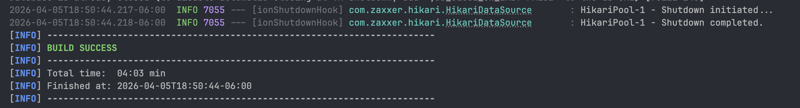
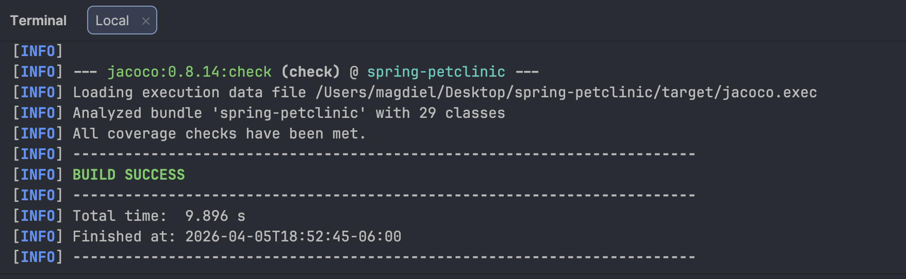

# Spring PetClinic Delivery Repository

[](https://github.com/solivalle/spring-petclinic/actions/workflows/maven-build.yml)
[](https://github.com/solivalle/spring-petclinic/actions/workflows/deploy-and-test-cluster.yml)
[](LICENSE.txt)
[](https://adoptium.net/)
[](https://spring.io/projects/spring-boot)

Course delivery repository based on Spring PetClinic, covering discovery, architecture decisions, security practices, and FinOps optimization.

## Quick Start

### Prerequisites

- JDK 17+
- Docker + Docker Compose (optional, required for containerized database/app execution)
- Node.js/npm (optional, only for Husky secret-scan hooks)
- k6 + jq (optional, only for reproducible FinOps benchmark)

**File:** [`fase_5/fase5.md`](fase_5/fase5.md)

# 🏛️ Legacy Readme

```bash
./mvnw spring-boot:run
```

Application URL: <http://localhost:8080>

### Build and run test suite

```bash
./mvnw clean verify
```

### Fast local checks

```bash
./mvnw -Dtest=OwnerSearchServiceTest,OwnerControllerTests test
```

## Authors

- Francisco Magdiel Asicona Mateo - `26006399`
- Sergio Rolando Oliva del Valle - `26005694`

## Deliveries

- Delivery 1 (Discovery): [`fase_1/fase1.md`](fase_1/fase1.md)
- Delivery 3 (Security): [`fase_3/snyk_overview.md`](fase_3/snyk_overview.md)
- Delivery 4 (Architecture): [`fase_4/fase4.md`](fase_4/fase4.md)
- Delivery 5 (FinOps Optimization): [`fase_5/fase5.md`](fase_5/fase5.md)

## Delivery 5 Highlights

- Resource-intensive path optimized: owner search read flow
- Refactor strategy: JPA projection endpoint (`GET /only/owners`)
- Benchmark before: `576 ms` (`GET /owners`)
- Benchmark after: `155 ms` (`GET /only/owners`)
- Improvement: `73.09%` faster
- Functional regression checks passed:

```bash
./mvnw -Dtest=OwnerSearchServiceTest,OwnerControllerTests test
```

## Reproducible FinOps Benchmark

This repository includes an executable benchmark flow for Delivery 5:

- `scripts/benchmark/owners-search.js` (k6 test)
- `scripts/run_finops_benchmark.sh` (runs baseline and optimized paths)
- Output folder: `fase_5/benchmark_results/`

Run:

```bash
./scripts/run_finops_benchmark.sh
```

With custom load profile:

```bash
VUS=40 DURATION=60s LAST_NAME=Sm ./scripts/run_finops_benchmark.sh
```

## Run with Persistent Databases

Database scripts are included in the repository and loaded by Spring SQL init (profile-based):

- H2: `src/main/resources/db/h2/schema.sql`, `src/main/resources/db/h2/data.sql`
- MySQL: `src/main/resources/db/mysql/schema.sql`, `src/main/resources/db/mysql/data.sql`
- PostgreSQL: `src/main/resources/db/postgres/schema.sql`, `src/main/resources/db/postgres/data.sql`

No manual migration step is required for local execution in the documented profiles.

### MySQL profile

Start MySQL:

```bash
docker compose up -d mysql
```

Run app against MySQL:

```bash
./mvnw spring-boot:run -Dspring-boot.run.profiles=mysql
```

### PostgreSQL profile

Start PostgreSQL:

```bash
docker compose up -d postgres
```

Run app against PostgreSQL:

```bash
./mvnw spring-boot:run -Dspring-boot.run.profiles=postgres
```

### Run app and database with Docker Compose

```bash
docker compose up -d app
```

Stop containers:

```bash
docker compose down
```

## Command Screenshots

### Spring Boot run command



### Maven verify command



## Useful Make Targets

```bash
make build
make up
make logs
make benchmark-finops
make down
```

## Security Hooks (Husky)

This repository uses a pre-commit secret scan.

One-time setup:

```bash
npm install
```

Emergency bypass (not recommended):

```bash
SKIP_SECRET_SCAN=1 git commit -m "your message"
```

## Troubleshooting

- Port `8080` in use: stop the existing process or run with `--server.port=<port>`.
- Maven dependency download issues: rerun `./mvnw clean verify` with network access.
- Docker DB startup delay: wait until containers are healthy before running the app.
- k6 benchmark not running: install `k6`; JSON comparison summary also requires `jq`.

## Legacy Documentation

- Legacy readme: [`docs/legacyreadme.md`](docs/legacyreadme.md)
