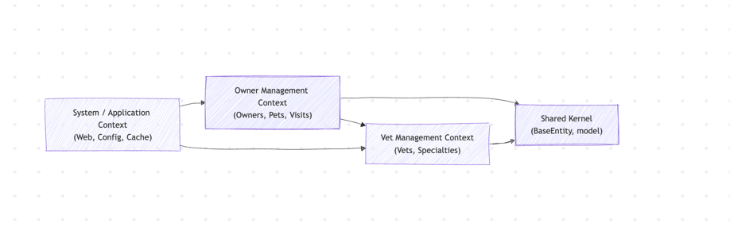
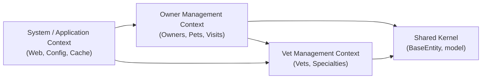

# 🤖 AI‑Driven Discovery & Context Map

**📘 Course Focus:** Requirements Engineering (AI‑Native) & Domain‑Driven Design  
**⏰ Deadline:** Week 2 – February 8th

**✍️ Authors:**
- Francisco Magdiel Asicona Mateo – 26006399
- Sergio Rolando Oliva del Valle – 26005694

---

## 🗺️ Main Bounded Contexts

### 🐶 Owner Management Context

**Purpose:** Manage clients and their pets

**High‑Level Concepts:**
- Owners
- Pets
- Pet Types
- Visits (history)

**Low‑Level (Java Classes):**
- Owner
- Pet
- Visit
- OwnerController
- PetController
- VisitController

---

### 🩺 Vet Management Context

**Purpose:** Manage veterinarians and their specialties

**High‑Level Concepts:**
- Vets
- Specialties

**Low‑Level (Java Classes):**
- Vet
- Speciality
- VetController
- VetRepository

---

### 🖥️ System / Application Context

**Purpose:** Infrastructure and web experience

**High‑Level Concepts:**
- Web configuration
- Caching
- Home page
- Error handling

**Low‑Level (Java Classes):**
- WelcomeController
- WebConfiguration
- CacheConfiguration

---

### 🔗 Shared Kernel

**Purpose:** Shared technical building blocks

Includes:
- BaseEntity
- Common domain structures

---

## 🧱 Domain Overview

### 🧠 Core Domains
- Owner Management
- Vet Management

### 🛠️ Supporting Domains
- System / Application Context

### 🔄 Integration Domains
- Simple integration through Shared Kernel

---

## 🏗️ System Architecture

- Monolithic
- Layered architecture

---

## 🧠 Context Map (MermaidJS)

- MermaidJS source

