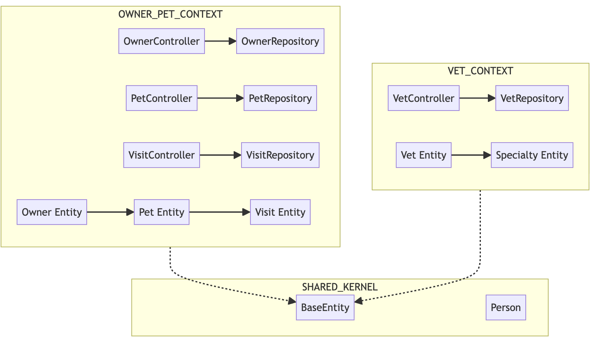
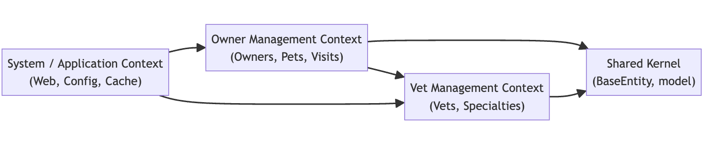

# 🗺️ Context Map - Domain-Driven Design Analysis

**📘 Course Focus:** Requirements Engineering (AI‑Native) & Domain‑Driven Design  
**⏰ Deadline:** Week 2 – February 8th

**✍️ Authors:**
- Francisco Magdiel Asicona Mateo – 26006399
- Sergio Rolando Oliva del Valle – 26005694

---

## 📊 Executive Summary

This document presents a comprehensive Domain-Driven Design (DDD) analysis of the Spring PetClinic codebase, identifying bounded contexts, integration patterns, and architectural relationships based on reverse engineering of the source code at `org.springframework.samples.petclinic`.

---

## 🗺️ Bounded Contexts Analysis

### 🐶 Owner Management Context

**Business Purpose:** Manage clinic clients (owners) and their pets, including medical visit history

**High-Level Domain Concepts:**
- Owner registration and search
- Pet ownership and lifecycle management
- Medical visit scheduling and history tracking
- Pet type categorization

**Technical Implementation:**
- **Controllers**: `OwnerController`, `PetController`, `VisitController`
- **Entities**: `Owner`, `Pet`, `Visit`, `PetType`
- **Repositories**: `OwnerRepository`, `PetTypeRepository`
- **Validators**: `PetValidator`

**Domain Invariants:**
- Owner must have address, city, and 10-digit telephone
- Pet name must be unique per owner
- Pet birth date cannot be in the future
- Visit must have description and date

**Files**: 
- `src/main/java/org/springframework/samples/petclinic/owner/*`

---

### 🩺 Vet Management Context

**Business Purpose:** Manage veterinarian staff and their medical specialties

**High-Level Domain Concepts:**
- Veterinarian directory
- Specialty assignment (many-to-many relationship)
- Paginated vet listing
- REST API for external integration

**Technical Implementation:**
- **Controllers**: `VetController`
- **Entities**: `Vet`, `Specialty`, `Vets` (collection wrapper)
- **Repositories**: `VetRepository`
- **Endpoints**: `/vets.html` (HTML), `/vets` (JSON/XML)

**Domain Invariants:**
- Vets can have zero or multiple specialties
- Specialties are shared across multiple vets

**Files**:
- `src/main/java/org/springframework/samples/petclinic/vet/*`

---

### 🖥️ System / Infrastructure Context

**Business Purpose:** Provide technical infrastructure, caching, and web configuration

**High-Level Domain Concepts:**
- Application bootstrapping
- JCache configuration (Caffeine provider)
- HTTP/View layer configuration
- Error handling and welcome page

**Technical Implementation:**
- **Controllers**: `WelcomeController`, `CrashController`
- **Configuration**: `CacheConfiguration`, `WebConfiguration`
- **Runtime**: `PetClinicRuntimeHints` (Native Image support)

**Technical Decisions:**
- Cache named "vets" for read-heavy veterinarian data
- Custom date formatting (`yyyy-MM-dd`)
- Thymeleaf template engine

**Files**:
- `src/main/java/org/springframework/samples/petclinic/system/*`

---

### 🔗 Shared Kernel

**Business Purpose:** Provide common building blocks across all bounded contexts

**Reusable Components:**
- **`BaseEntity`**: Abstract superclass with auto-generated ID
- **`Person`**: Abstract superclass for human entities (firstName, lastName)
- **`NamedEntity`**: Abstract superclass for named domain objects

**Strategy Pattern:**
- ID generation: `@GeneratedValue(strategy = GenerationType.IDENTITY)`
- All entities implement `Serializable`
- `isNew()` method for entity state detection

**Files**:
- `src/main/java/org/springframework/samples/petclinic/model/*`

---

## 🧱 Domain Classification

### 🧠 Core Domains (Business Differentiators)
- **Owner Management**: Primary business value - customer relationship management
- **Vet Management**: Critical for clinic operations - staff expertise tracking

### 🛠️ Supporting Domains
- **System/Infrastructure Context**: Enables core domains but not business-differentiating

### 🔧 Generic Subdomains
- **Shared Kernel**: Standard persistence patterns, no custom business logic

---

## 🏗️ System Architecture

**Architectural Style**: Modular Monolith with DDD package structure

**Layer Architecture**:
```
┌─────────────────────────────────────┐
│   Presentation Layer (Controllers)  │
├─────────────────────────────────────┤
│   Application Layer (implicit)      │
├─────────────────────────────────────┤
│   Domain Layer (Entities)           │
├─────────────────────────────────────┤
│   Infrastructure (Repositories)     │
└─────────────────────────────────────┘
```

**Technology Stack**:
- Spring Boot 4.0.1
- Spring Data JPA
- Hibernate ORM
- Thymeleaf (server-side rendering)
- JCache (Caffeine implementation)

---

## 🧠 Context Map Visualization (MermaidJS)



---

## 🔗 Integration Patterns (DDD Context Mapping)

| Upstream Context | Downstream Context | Pattern | Explanation |
|-----------------|-------------------|---------|-------------|
| Shared Kernel | Owner Context | **Conformist** | Owner Context depends on `Person` and `BaseEntity` without negotiating changes |
| Shared Kernel | Vet Context | **Conformist** | Vet Context depends on `Person` and `BaseEntity` without negotiating changes |
| Vet Context | System Context | **Anti-Corruption Layer (ACL)** | `CacheConfiguration` wraps caching logic without affecting Vet domain |
| Owner Context | Vet Context | **Separate Ways** | No direct integration; both contexts are functionally independent |

**Real-World Analogy**: Like a city map where residential zones (Owner Context) and medical districts (Vet Context) are separate but share common infrastructure (Shared Kernel) like roads and utilities.

---

## 📈 Strategic Design Insights

### Strengths
✅ Clear package-by-feature organization  
✅ Proper use of JPA relationships (cascade, fetch strategies)  
✅ Separation of concerns between contexts  
✅ Shared Kernel properly abstracted

### Architectural Debts
⚠️ **Missing Service Layer**: Business logic embedded in controllers  
⚠️ **Anemic Domain Model**: Entities lack behavior (mostly getters/setters)  
⚠️ **Repository Proliferation**: No Repository abstraction/interface consistency  
⚠️ **No API Versioning**: REST endpoints lack version control

### Modernization Opportunities
🔄 Introduce Service Layer pattern for business logic encapsulation  
🔄 Enrich domain models with behavior (Rich Domain Model)  
🔄 Consider Event-Driven Architecture for cross-context communication  
🔄 Implement API Gateway pattern if moving toward microservices

---

## 📚 References

- **Source Code**: `src/main/java/org/springframework/samples/petclinic/`
- **DDD Patterns**: Evans, Eric. "Domain-Driven Design" (2003)
- **Context Mapping**: Vernon, Vaughn. "Implementing Domain-Driven Design" (2013)

- MermaidJS source

