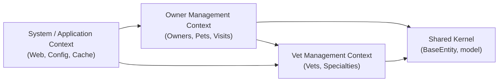

# 🚀 Delivery 1: Discovery & Reverse Engineering

**📘 Course Focus:** Requirements Engineering (AI‑Native) & Domain‑Driven Design  
**⏰ Deadline:** Week 2 – February 8th

**✍️ Authors:**
- Francisco Magdiel Asicona Mateo – 26006399
- Sergio Rolando Oliva del Valle – 26005694

---

## 🎯 Objectives

- 🧪 Perform a DevEx Audit through an onboarding log
- 🤖 Analyze the codebase using AI assistance
- 🧩 Identify main Bounded Contexts using DDD
- 🗺️ Generate a Context Map using MermaidJS
- 📝 Recover the current backlog in the form of user stories

---

## 🧩 Tasks Overview

- **🧭 Onboarding Log:** Document the pain points during project setup (DevEx Audit)
- **🤖 AI‑Driven Discovery:** Analyze the codebase and generate a Context Map (MermaidJS)
- **📝 Backlog Recovery:** Generate user stories supported by the current system

---

## 📋 Mini‑Rubric

- [x] 🗺️ Context Map accurately reflects the codebase structure
- [x] 🔗 User Stories are traceable to specific modules/files
- [x] ⚠️ Onboarding log clearly identifies friction points

---

## 🧭 Onboarding Log

### 🔍 Scope

Evaluate the project from download, setup, build, deploy, and verification.

### 🔁 Feedback Loops

- **⏱️ TTB (Time To Build):** ~5 minutes
- **🧪 Time for Testing:** Not clearly measurable; tests are not properly set up

### 🧠 Cognitive Load

- README exists but lacks sufficient setup details
- Documentation assumes:
    - A pre‑compiled version of the project
    - Correct Java version already installed
    - Prior knowledge on how to compile the project
- Tests exist but their correctness is uncertain

### 🌊 Flow State

- Manual compilation required
- Manual environment setup required
- Runtime exceptions appear while the application is running, unclear if expected

### 📊 Evidence

**⏰ Setup Time:** ~15–20 minutes

Steps and findings:
- ☕ Java 17 installation required (initial attempts were done with Java 21)
- 🔧 Manual compilation required
- ✅ Tests are not blocking the build (positive)
- ❌ Tests do not run during build (concerning)
- 📦 Git clone failed due to permissions; project was downloaded as ZIP

### ⚠️ Pain Points

- Digging into the correct JDK version
- Unclear setup instructions
- Poor technical and high‑level documentation
- Documentation mixes user manuals, class diagrams, and architecture

### 💡 Suggested Improvements

- Clearly document required JDK version
- Separate unit tests from functional tests
- Include unit tests in the build pipeline
- Document functional test setup separately
- Document required dependencies (Docker, MySQL, etc.)
- Refactor project structure to better classify tests

---

## 🤖 AI‑Driven Discovery

### 🗺️ Main Bounded Contexts

#### 🐶 Owner Management Context

**Purpose:** Manage clients and their pets

**High‑Level Concepts:**
- Owners
- Pets
- Pet Types
- Visits (history)

**Low‑Level (Java Classes):**
- Owner
- Pet
- Visit
- OwnerController
- PetController
- VisitController

---

#### 🩺 Vet Management Context

**Purpose:** Manage veterinarians and their specialties

**High‑Level Concepts:**
- Vets
- Specialties

**Low‑Level (Java Classes):**
- Vet
- Speciality
- VetController
- VetRepository

---

#### 🖥️ System / Application Context

**Purpose:** Infrastructure and web experience

**High‑Level Concepts:**
- Web configuration
- Caching
- Home page
- Error handling

**Low‑Level (Java Classes):**
- WelcomeController
- WebConfiguration
- CacheConfiguration

---

#### 🔗 Shared Kernel

**Purpose:** Shared technical building blocks

Includes:
- BaseEntity
- Common domain structures

---

## 🧱 Domain Overview

### 🧠 Core Domains
- Owner Management
- Vet Management

### 🛠️ Supporting Domains
- System / Application Context

### 🔄 Integration Domains
- Simple integration through Shared Kernel

---

## 🏗️ System Architecture

- Monolithic
- Layered architecture

---

## 🧠 Context Map (MermaidJS)

- MermaidJS source

---

## 📝 Backlog Recovery

### 🐶 Owner Management Context

#### Owner Management

- **US‑01:** As a receptionist, I want to register a new owner with basic information so that I can associate pets to them.
- **US‑02:** As a receptionist, I want to search owners by last name so that I can quickly find their records.
- **US‑03:** As a receptionist, I want to view owner details so that I can see their pets and visit history.
- **US‑04:** As a receptionist, I want to edit owner information to keep the data up to date.

---

#### Pet Management

- **US‑05:** As a receptionist, I want to register a pet for an existing owner so that the pet is properly linked to its owner.
- **US‑06:** As a receptionist, I want to edit pet information to correct or update pet details.
- **US‑07:** As a receptionist, I want to assign a pet type (dog, cat, etc.) so that pets are properly categorized.

---

#### Visit Management

- **US‑08:** As a receptionist, I want to record a medical visit for a pet so that the pet’s medical history is maintained.
- **US‑09:** As a veterinarian, I want to view a pet’s visit history so that I can understand previous treatments.
- **US‑10:** As a receptionist, I want to view all visits associated with an owner to have a complete customer overview.

---

### 🩺 Vet Management Context

#### Veterinarian Management

- **US‑11:** As an administrator, I want to view the list of veterinarians so that I know who works at the clinic.
- **US‑12:** As an administrator, I want to register a veterinarian to expand the medical staff.
- **US‑13:** As an administrator, I want to assign specialties to a veterinarian so that their expertise is accurately represented.
- **US‑14:** As a veterinarian, I want to view my specialties so that I can verify my professional profile.

---

### 🖥️ System / Application Context

#### System & User Experience

- **US‑15:** As a system user, I want to see a welcome screen so that I understand the purpose of the application.
- **US‑16:** As a system user, I want to navigate easily between owners and veterinarians so that I can perform my tasks efficiently.
- **US‑17:** As a system user, I want the system to handle errors clearly so that I understand what went wrong and how to proceed.
- **US‑18:** As a system administrator, I want frequently accessed data to be cached so that system performance is improved.

---

### 🔗 Shared Kernel (Technical User Stories)

- **US‑19:** As a developer, I want to use a shared base entity so that entity identification and persistence are standardized.
- **US‑20:** As a development team, I want to reuse common domain models so that duplication across contexts is reduced.

---

## 🚧 Identified Friction Points (DevEx Audit Summary)

Based on the onboarding experience and the documented setup process, the following friction points were identified. These represent concrete obstacles that negatively impact developer experience, onboarding speed, and confidence when working with the project.

### 1️⃣ Unclear Java Version Requirement

- The documentation does not explicitly state the required JDK version.
- Initial attempts to run the project with Java 21 failed, requiring trial-and-error to discover that Java 17 was needed.
- This increases setup time and cognitive load, especially for new contributors.

**Impact:** Slower onboarding, unnecessary context switching, and frustration during initial setup.

---

### 2️⃣ Incomplete and Assumptive Documentation

- The README assumes prior knowledge about how to compile and run the project.
- It implicitly assumes the user has a pre-compiled artifact or knows the full build process.
- Key steps (build commands, environment preparation) are not clearly documented.

**Impact:** New developers must reverse-engineer the setup instead of following a guided process.

---

### 3️⃣ Manual and Non-Automated Build Process

- The project requires manual compilation and environment configuration.
- There is no clear one-command build or standardized setup script.
- This breaks flow state and increases the likelihood of human error.

**Impact:** Reduced productivity and inconsistent local environments across developers.

---

### 4️⃣ Testing Setup Is Unclear and Not Integrated into the Build

- Tests exist, but it is unclear whether they are properly configured or reliable.
- Tests do not run as part of the normal build process.
- There is no guidance on how or when tests should be executed.

**Impact:** Low confidence in system stability and risk of undetected regressions.

---

### 5️⃣ Missing Documentation of External Dependencies

- Required dependencies such as databases, Docker, or other infrastructure components are not documented.
- Developers must infer or discover dependencies by inspecting the code.

**Impact:** Increased setup time and higher risk of misconfigured environments.

---
