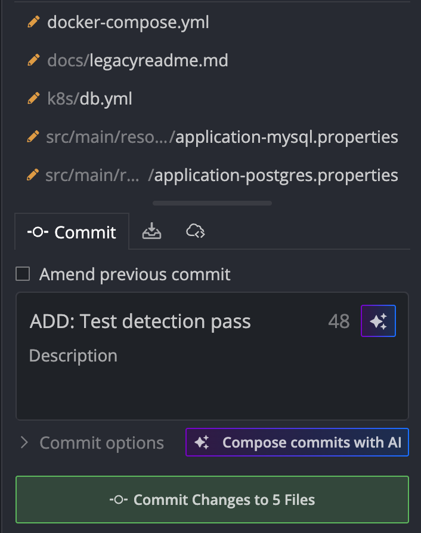
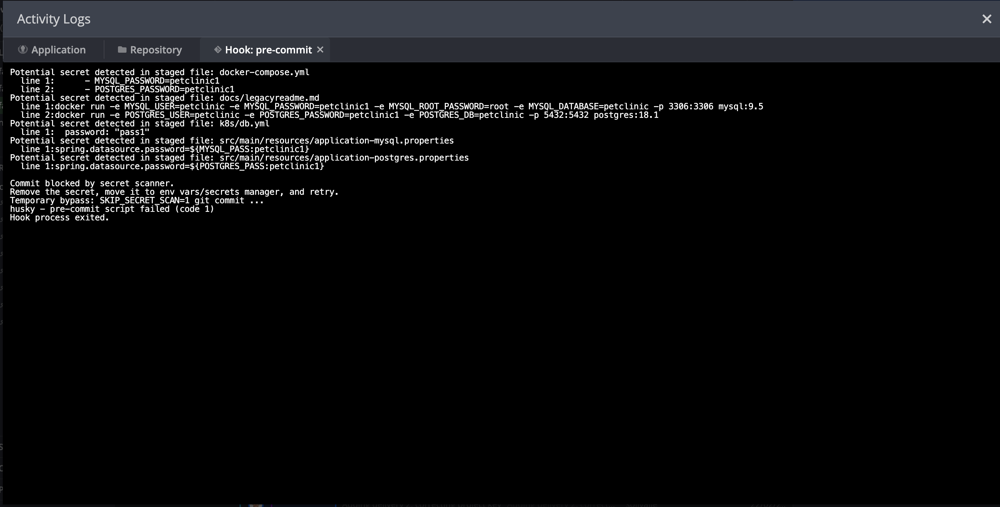

# Secret Protection Report

## Overview

This report documents the implementation and validation of secret protection in the repository using a **Husky pre-commit hook**.  
The objective is to prevent committing hardcoded credentials such as API keys, tokens, passwords, and private keys.

## Implemented Control

The project includes a pre-commit workflow that runs automatically on each `git commit`:

- Husky is configured through `package.json` (`prepare` script).
- The hook is defined in `.husky/pre-commit`.
- The secret scanner logic is implemented in `scripts/pre-commit-secret-scan.sh`.

If suspicious secrets are found in staged changes, the commit is blocked.

## Evidence

### 1) Commit with modified files

The following screenshot shows the files prepared in the commit:

### 2) Pre-commit validation result

The following screenshot shows the pre-commit validation execution confirming secret checks before allowing the commit:

## Conclusion

Secret protection is now enforced at commit time.  
This reduces the risk of exposing hardcoded credentials in the repository and supports secure development practices.
