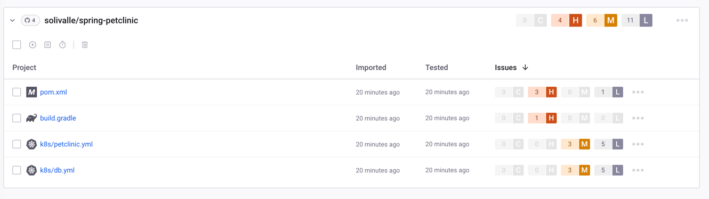
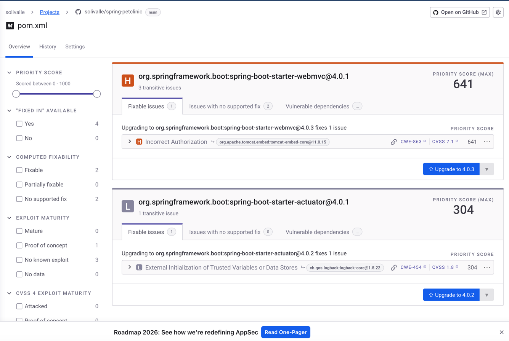
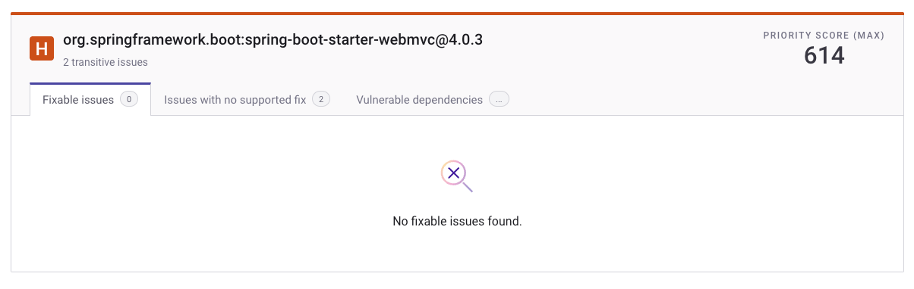

# Vulnerability Patching with Snyk

## Overview

As part of the security assessment process for this project, a dependency vulnerability scan was performed using the tool :contentReference[oaicite:0]{index=0}. The purpose of this scan was to identify known security vulnerabilities in the project's dependencies and address them through appropriate remediation strategies.

The scan revealed multiple vulnerabilities, including two that were prioritized for remediation. These vulnerabilities were addressed by updating the affected dependencies to secure versions.

---

## Initial Vulnerability Scan

The first scan identified several issues across different project files. The overview of the scan results is shown below.

The results indicate that vulnerabilities were detected in dependency definitions and related configuration files within the project.

---

## Detailed Vulnerability Findings

A closer inspection of the dependency scan highlighted specific vulnerable components within the application's dependency tree. In particular, vulnerabilities were found in the Spring Boot dependencies used by the application.

Examples of the issues identified include:

- A vulnerability related to **incorrect authorization handling** in the dependency `org.apache.tomcat.embed:tomcat-embed-core`.
- A vulnerability related to **external initialization of trusted variables or data stores** in the dependency `ch.qos.logback:logback-core`.

These vulnerabilities were introduced transitively through the following dependencies:

- `org.springframework.boot:spring-boot-starter-webmvc`
- `org.springframework.boot:spring-boot-starter-actuator`

Snyk reported that these issues could be resolved by upgrading the affected dependencies to newer versions where the vulnerabilities have been addressed.

---

## Remediation Strategy

The vulnerabilities were fixed through a dependency **update**, which is a recommended remediation method when patched versions of libraries are available.

The following updates were applied:

- `org.springframework.boot:spring-boot-starter-webmvc` was upgraded from version **4.0.1** to **4.0.3**
- `org.springframework.boot:spring-boot-starter-actuator` was upgraded from version **4.0.1** to **4.0.2**

Upgrading these dependencies resolved the transitive vulnerabilities present in:

- `org.apache.tomcat.embed:tomcat-embed-core`
- `ch.qos.logback:logback-core`

This approach aligns with best practices in dependency management, where vulnerabilities are mitigated by moving to maintained and secure versions of the libraries.

---

## Verification After Fix

After applying the updates, the project was scanned again using Snyk to verify that the vulnerabilities had been successfully resolved.

The follow-up scan confirmed that the previously identified vulnerabilities were no longer present in the project. This demonstrates that the dependency updates effectively mitigated the security risks identified during the initial scan.

---

## Conclusion

The security scan performed with Snyk successfully identified vulnerabilities within the project's dependency tree. Two key vulnerabilities were addressed by upgrading the affected dependencies to patched versions.

After applying these updates and performing a second scan, the project no longer reported the previously identified issues. This process demonstrates the importance of regularly scanning dependencies and promptly updating them to maintain a secure software supply chain.

ref: https://app.snyk.io/org/solivalle/project/a166ab0b-fe5a-4e56-8d96-4b48dbcbb5b5
