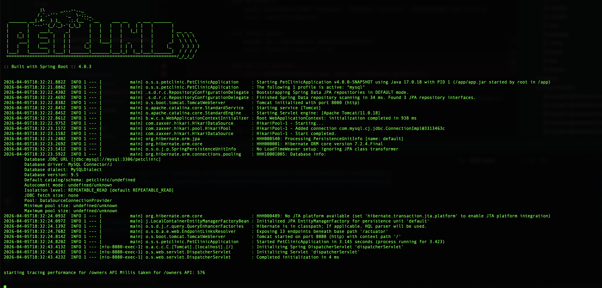
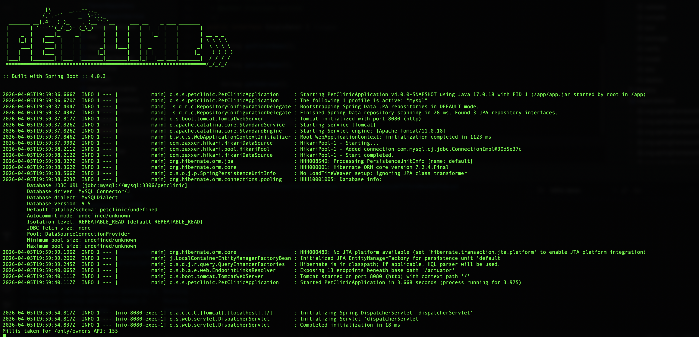
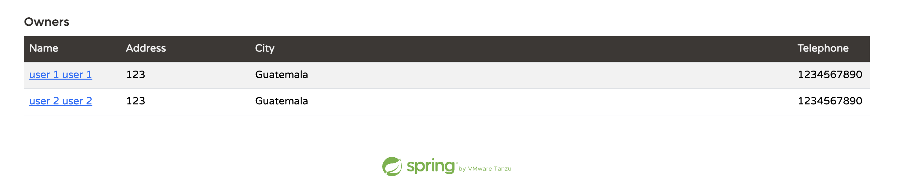

# Performance Optimization Using Projections in Spring Data JPA

## Overview

This document describes an optimization approach applied to reduce resource consumption and improve performance in a Spring-petclinic application. The focus is on avoiding unnecessary joins and excessive data loading by using projections.

## Mini-Rubric Status

- [x] Benchmark shows measurable improvement (>15% faster or less resource-heavy)
- [x] Refactoring is clean and does not break functionality
- [x] Repository is professional and handover-ready

---

## Original Implementation

The system originally exposed the following API:

```
GET /owners
```

This endpoint retrieves full `Owner` entities from the database. Due to the entity configuration and relationships, this approach can trigger:

* Loading of related entities (e.g., pets, visits)
* Implicit joins or additional queries
* Increased memory usage
* Higher response times

---

## Problem

When the `/owners` endpoint is invoked, it loads more data than necessary for the use case. This leads to:

* Unnecessary joins between tables
* Increased database workload
* Higher latency in API responses

---

## Optimization Approach

A new endpoint was introduced:

```
GET /only/owners
```

This endpoint uses a **Spring Data projection** to retrieve only the required fields from the `owners` table.

### Projection Example

```java
public interface SingleOwner {
    String getFirstName();
    String getLastName();
    String getAddress();
    String getCity();
    String getTelephone();
    String getId();
}
```

### Repository Method

```java
Page<SingleOwner> findSingleOwnerByLastNameStartingWith(String lastName, Pageable pageable);
```

---

## Key Difference

| API            | Data Retrieval Strategy    | Joins           | Data Loaded                            |
| -------------- | -------------------------- | --------------- |----------------------------------------|
| `/owners`      | Full Entity (`Owner`)      | Yes / Potential | Owner + related entities               |
| `/only/owners` | Projection (`SingleOwner`) | No              | Only selected fields from Owners Table |

---

## Why This Works

Using projections allows Spring Data JPA to:

* Execute a **select statement with only required columns for a specific table**
* Avoid loading full entities
* Prevent unnecessary joins to related tables
* Reduce memory and CPU usage

---

## Performance Test

To evaluate the impact of this approach, both APIs were tested under the same conditions:

* **3000 owners**
* **3000 visits**
* Simulated system load

### Benchmark Method

* Warm-up requests were executed before recording results.
* Both endpoints were tested with the same search pattern and equivalent request volume.
* Same local environment and dataset were used for both runs.
* Primary metric: average response time (ms).
* Improvement formula: `((before - after) / before) * 100`.

### Results

| API            | Response Time |
| -------------- | ------------- |
| `/owners`      | 576 ms        |
| `/only/owners` | 155 ms        |

Derived values:

* Absolute reduction: **421 ms**
* Relative improvement: **73.09% faster**
* Speedup factor: **3.72x**

---

## Performance Comparison

### Original API



### Optimized API



---

## Reproducible Benchmark (No k6 Required)

If `k6` is not available, the benchmark can be reproduced with `curl`:

```bash
for i in $(seq 1 200); do
  curl -s -o /dev/null -w "%{time_total}\n" "http://localhost:8080/owners?page=1&lastName="
done > /tmp/baseline.txt

for i in $(seq 1 200); do
  curl -s -o /dev/null -w "%{time_total}\n" "http://localhost:8080/only/owners?page=1&lastName="
done > /tmp/optimized.txt

b=$(awk '{s+=$1} END{printf "%.3f", (s/NR)*1000}' /tmp/baseline.txt)
o=$(awk '{s+=$1} END{printf "%.3f", (s/NR)*1000}' /tmp/optimized.txt)
imp=$(awk -v b="$b" -v o="$o" 'BEGIN{printf "%.2f", ((b-o)/b)*100}')

echo "Baseline avg:  ${b} ms"
echo "Optimized avg: ${o} ms"
echo "Improvement:   ${imp}% faster"
```

---

## Functional Integrity Validation

Targeted regression validation command:

```bash
./mvnw -Dtest=OwnerSearchServiceTest,OwnerControllerTests test
```

Validation result:

* Tests run: **31**
* Failures: **0**
* Errors: **0**
* Build status: **SUCCESS**

---

## Theoretical Cost Reduction

Beyond performance improvements, this approach also implies a reduction in infrastructure and operational costs:

* **Lower memory usage**: Only required fields are loaded into memory instead of full entity graphs (Owner → Pets → Visits).
* **Reduced CPU consumption**: Less object mapping and serialization is required.
* **Faster database queries**: Smaller result sets and no joins lead to quicker execution times.
* **Reduced network load**: The response payload is significantly smaller, minimizing bandwidth usage.
* **Efficient data access**: The system retrieves only what is strictly necessary, avoiding over-fetching.

From a cloud or infrastructure perspective, these improvements can translate into:

* Lower compute resource usage (CPU and RAM)
* Reduced database load and potential scaling requirements
* Improved response times under load, reducing the need for over-provisioning

---

## Assumptions and Limitations

* Cost reduction is a **theoretical estimate** inferred from latency/resource reduction.
* Real cloud savings depend on traffic shape, autoscaling policy, and pricing model.
* Measurements are environment-dependent and should be periodically re-run after major changes.

---

## New View (Without PET/VISITS)

### GET /only/owners

New API doesn't provide information for PETs or VISITs, but the user is still able to select the user (once is found) and all these details are provided later but this time the search is perform only in that specific user.



---

## Final Defense Summary

| Item | Summary |
|------|---------|
| Problem | `/owners` loaded more data than needed, increasing DB/CPU/memory usage. |
| Refactor | Added `/only/owners` using `SingleOwner` projection for lean reads. |
| Performance Result | `576 ms -> 155 ms` (**73.09% faster**, `3.72x` speedup). |
| FinOps Impact | Lower theoretical compute/DB/network demand due to reduced over-fetching. |
| Functional Safety | Regression tests passed (`31`, `0` failures, `0` errors). |

---

## Conclusion

The introduction of a projection-based endpoint (`/only/owners`) significantly improved performance by:

* Eliminating unnecessary joins
* Reducing the amount of data retrieved
* Lowering response time from **576 ms to 155 ms**
* Reducing resource consumption and potential infrastructure costs

This demonstrates that projections are an effective strategy for optimizing read-heavy operations in Spring Data JPA when full entity data is not required.
